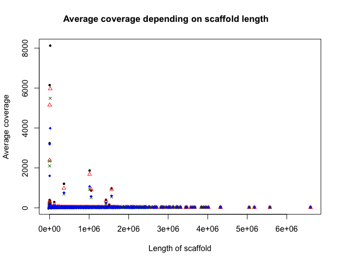
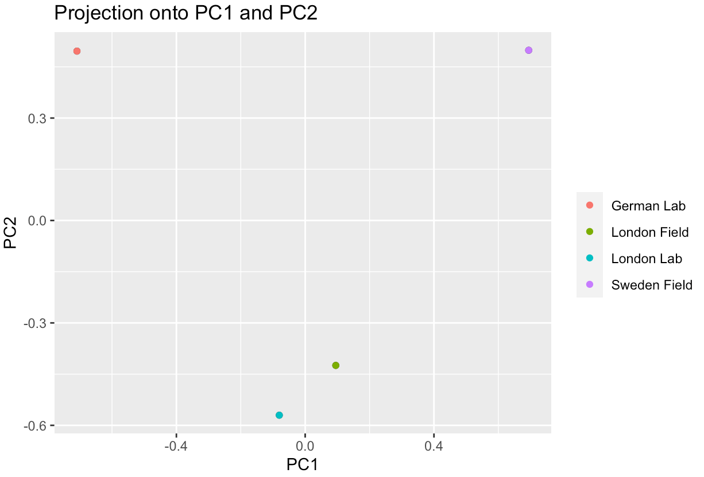
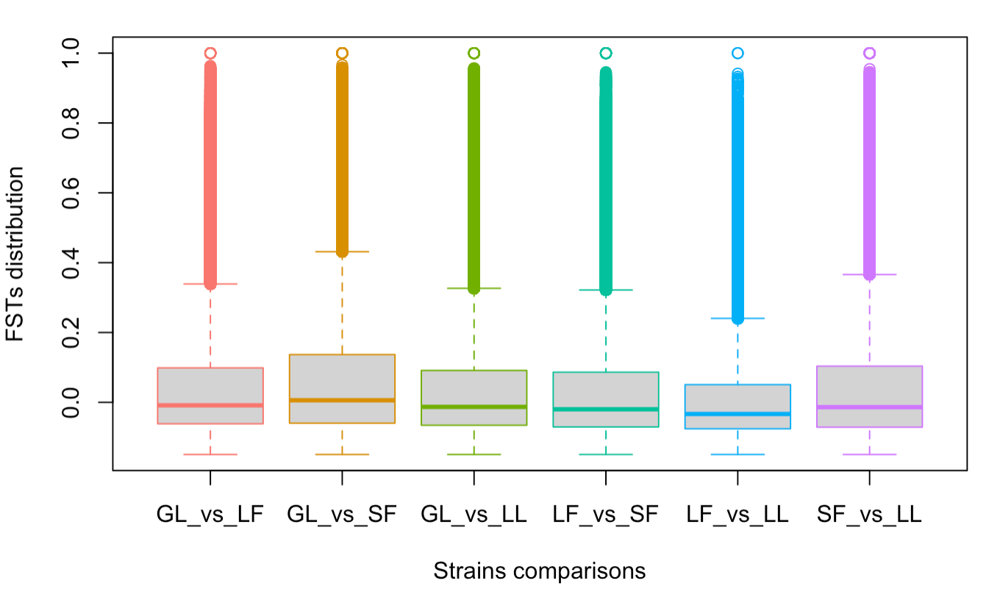
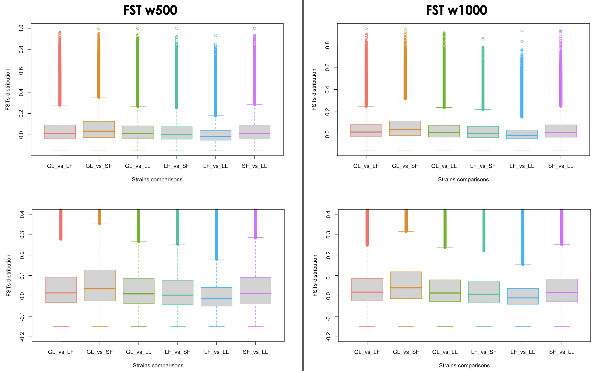
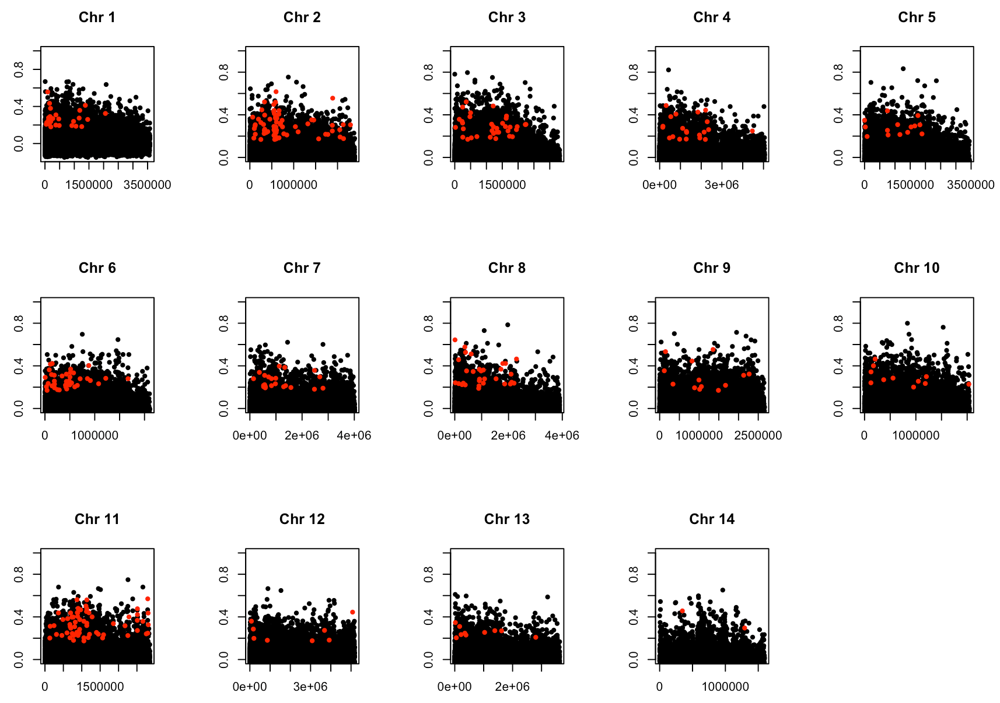
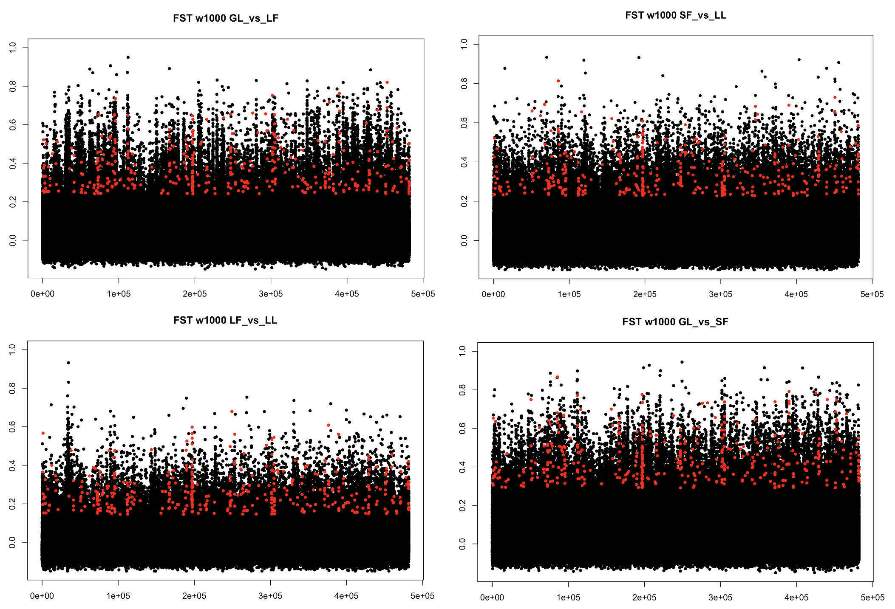
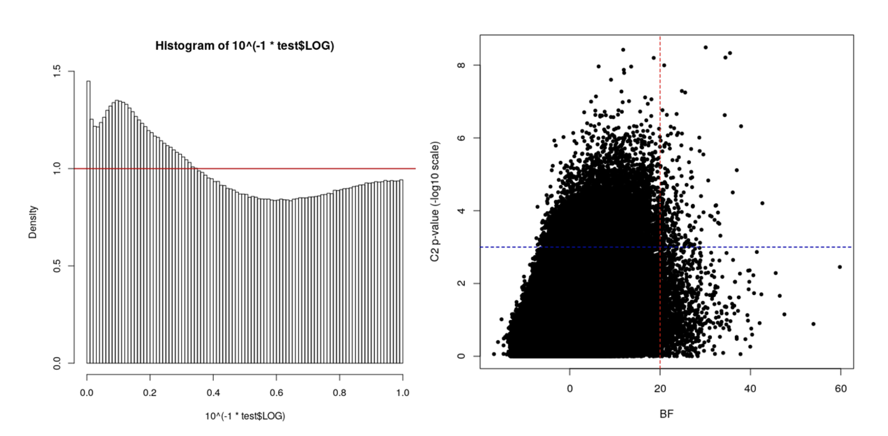
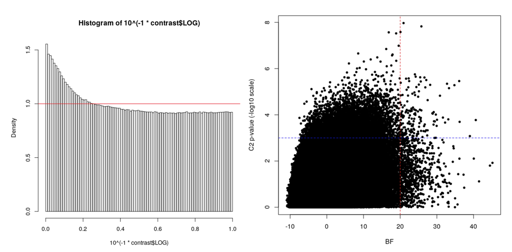

Contact : chloe.haberkorn@univ-lyon1.fr

### Table of Contents

- **[Mapping and processing Pool-seq genomes](#Mapping-and-processing-Pool-seq-genomes)**
	- [Installing tools](#Installing-tools)
	- [Getting the data](#Getting-the-data)
	- [Trimming](#Trimming)
	- [Removing duplicates](#Removing-duplicates)
	- [Mapping](#Mapping)
	- [Analysing coverage](#Analysing-coverage)

- **[Genetic differenciation of populations](#Genetic-differenciation-of-populations)**
	- [Installing tools](#Installing-tools)
	- [Detecting SNPs](#Detecting-SNPs)
	- [Compute FST](#Compute-FST)

- **[Genetic polymorphism within populations](#Genetic-polymorphism-within-populations)**
	- [Installing tools](#Installing-tools)
	- [Compute pi and Tajima's D](#Compute-pi-and-Tajimas-D)

- **[Evidence of selection](#Evidence-of-selection)**
	- [Installing tools](#Installing-tools)
	- [Identifying genetic markers under selection](#Identifying-genetic-markers-under-selection)
	- [Mapping areas under selection](#Mapping-areas-under-selection)

## Mapping and processing Pool-seq genomes

The goal is first to map *Cimex lectularius* PoolSeq samples on reference genome : London Lab, London Field, German Lab, Sweden Field (pools of 30 individuals).
We can benefit from the recent reference genome and annotation, avalaible here : https://www.ncbi.nlm.nih.gov/assembly/GCF_000648675.2

We will have to download a few softs.

### Install tools

BWA :
``` 
git clone https://github.com/lh3/bwa.git
cd bwa
make
/beegfs/data/chaberkorn/Tools/bwa/bwa index # Check that the soft is working 
```

Trimmomatic :
We will have to download the associated adapters. To do so : in fastq file, look at overrepresented sequences -> "TruSeq Adapter". These primers come from the TruSeq-3 library.
``` 
chaberkorn@pbil-deb:/beegfs/data/chaberkorn/Tools/trimmomatic-0.39
chaberkorn@pbil-deb:/beegfs/data/chaberkorn/Tools/TruSeq3-PE.fa
``` 

Bedtools :
``` 
chaberkorn@pbil-deb:/beegfs/data/chaberkorn/Tools/bedtools2
``` 

FastUniq :
``` 
chaberkorn@pbil-deb:/beegfs/data/chaberkorn/Tools/FastUniq
``` 

### Getting the data

```
#Create directory with raw sequences
mkdir /beegfs/data/chaberkorn/PoolSeq_Clec/Raw_Clec
cp -r /beegfs/data/varaldi/BEDBUGS/data_preliminary/*R*.fastq.gz /beegfs/data/chaberkorn/PoolSeq_Clec/Raw_Clec
tar xvf fastqc.tar.gz

#Create directory with reference genome 
mkdir /beegfs/data/chaberkorn/PoolSeq_Clec/Ref_Clec

#Open a terminal to move reference genome downloaded on computer to Beegfs
scp -r /Users/chloe/Documents/Cluster chaberkorn@pbil-deb:/beegfs/data/chaberkorn/PoolSeq_Clec/Ref_Clec
```

### Trimming

Keep default parameters :
ILLUMINACLIP:TruSeq3-PE.fa:2:30:10:2:keepBothReads 
  - TruSeq3-PE.fa = according to fastq file infos
  - 2 = seed mismatches
  - 30 = palindrome clip threshold
  - 10 = simple clip threshold
  - 2 = min Adapter Length
SLIDINGWINDOW:4:20 -> too high, use 15 instead

```
cd /beegfs/data/chaberkorn/PoolSeq_Clec/Trimmed
nano trimm_LL.sh

#!/bin/bash
#SBATCH --cpus-per-task=8
#SBATCH --mem 10G
#SBATCH -t 24:00:00
#SBATCH -e /beegfs/data/chaberkorn/PoolSeq_Clec/Trimmed/Trimming_LL.error
#SBATCH -o /beegfs/data/chaberkorn/PoolSeq_Clec/Trimmed/Trimming_LL.out
#SBATCH -J Genome_trimming_Cimex_lectularius

DIR=/beegfs/data/chaberkorn/PoolSeq_Clec
DIRSOFT=/beegfs/data/chaberkorn/Tools
DIRFASTQ="$DIR"/Raw_Clec

/usr/local/jre1.8.0_202/bin/java -jar "DIRSOFT"/trimmomatic-0.39.jar PE -phred33 -trimlog LL_trim.log \
"DIRFASTQ"/LL_R1.fastq.gz "DIRFASTQ"/LL_R2.fastq.gz \
LL_R1_paired.fq.gz LL_R1_unpaired.fq.gz LL_R2_paired.fq.gz LL_R2_unpaired.fq.gz \
ILLUMINACLIP:"DIRSOFT"/TruSeq3-PE.fa:2:30:10:2:keepBothReads LEADING:3 TRAILING:3 SLIDINGWINDOW:4:20 MINLEN:50 

gunzip LF_*_paired.fq.gz

# Check filtering quality using fastq :
/beegfs/data/chaberkorn/Tools/FastQC/fastqc --java /usr/local/jre1.8.0_202/bin/java LF_R1_paired.fq
/beegfs/data/chaberkorn/Tools/FastQC/fastqc --java /usr/local/jre1.8.0_202/bin/java LF_R2_paired.fq
```

Count the number of sequences (starting with "@") with : 

```
grep -c @ LF_R2_paired.fq
```

### Removing duplicates

Using FastUniq

-t q : output sequence format - FASTQ format into TWO output files
-o : premier output
-p : deuxieme output
-c 1 : types of sequence descriptions for output - new serial numbers assigned by FastUniq (0 : the raw descriptions)

```
gunzip *_paired.fq.gz # R1 and R2 for each pop
# Create a text file with both input : R1 and R2 > input_LL.txt

nano LL_dup.txt

#!/bin/bash
#SBATCH --cpus-per-task=8
#SBATCH --mem 10G
#SBATCH -t 24:00:00
#SBATCH -e /beegfs/data/chaberkorn/PoolSeq_Clec/Trimmed/LL_dup.error
#SBATCH -o /beegfs/data/chaberkorn/PoolSeq_Clec/Trimmed/LL_dup.out
#SBATCH -J Genome_duplicates_Cimex_lectularius

/beegfs/data/chaberkorn/Tools/FastUniq/source/fastuniq -i input_LL.txt -t q -o LL_dup_1.fastq -p LL_dup_2.fastq -c 1

# Check how many duplicate sequences have been deleted:
/beegfs/data/chaberkorn/Tools/FastQC/fastqc --java /usr/local/jre1.8.0_202/bin/java LL_dup_1.fastq
/beegfs/data/chaberkorn/Tools/FastQC/fastqc --java /usr/local/jre1.8.0_202/bin/java LL_dup_2.fastq
```

### Mapping

```
nano mapping_LL.sh

#!/bin/bash
#SBATCH --cpus-per-task=8
#SBATCH --mem 10G
#SBATCH -t 24:00:00
#SBATCH -e /beegfs/data/chaberkorn/PoolSeq_Clec/Mapped/mapping_LL.error
#SBATCH -o /beegfs/data/chaberkorn/PoolSeq_Clec/Mapped/mapping_LL.out
#SBATCH -J Genome_mapping_Cimex_lectularius

/beegfs/data/chaberkorn/Tools/bwa/bwa mem -t 8 /beegfs/data/chaberkorn/PoolSeq_Clec/Ref_Clec/ncbi-genomes-2020-12-15/GCF_000648675.2_Clec_2.1_genomic.fna \
/beegfs/data/chaberkorn/PoolSeq_Clec/Trimmed/LL_dup_1.fastq /beegfs/data/chaberkorn/PoolSeq_Clec/Trimmed/LL_dup_2.fastq > LL_mapped.sam
```

Now we want to control mapping quality, while converting file from sam to bam

Two options : keep all reads (and know the percentage mapping via flagstat)
Or: separate mapped reads from unmapped reads (see /beegfs/data/chaberkorn/PoolSeq_Clec/Mapped/SEP_MAP_UNMAP) :

```
/beegfs/data/soft/samtools-1.10/bin/samtools view -bS -F 4 GL_mapped.sam > GL_mapped.bam
/beegfs/data/soft/samtools-1.10/bin/samtools view -bS -f 4 SF_mapped.sam > SF_unmapped.bam
```

To keep only the reads whose mapping has a probability > 99% to be correct : add on samtools view "-q 20".

```
#!/bin/bash
#SBATCH --cpus-per-task=8
#SBATCH --mem 10G
#SBATCH -t 24:00:00
#SBATCH -e /beegfs/data/chaberkorn/PoolSeq_Clec/Mapped/stats_SF.err
#SBATCH -o /beegfs/data/chaberkorn/PoolSeq_Clec/Mapped/stats_SF.out
#SBATCH -J Genome_stats_Cimex_lectularius

/beegfs/data/soft/samtools-1.10/bin/samtools view -bS -@ 2 GL_mapped.sam > GL_mapped.bam  

/beegfs/data/soft/samtools-1.10/bin/samtools sort GL_mapped.bam -o GL_mapped_sorted.bam

rm GL_mapped.bam

/beegfs/data/soft/samtools-1.9/bin/samtools flagstat GL_mapped_sorted.bam > flagstat_GL.txt
```

### Analysing coverage 

Calculer les couvertures par base (combien de reads mappent à une position du genome de reference = 1 NT)
Pour uniquement les reads mappes (-F 4 ; mapped_sorted) 

```
nano cov_SF_mapped_sorted.sh

#!/bin/bash
#SBATCH --cpus-per-task=8
#SBATCH --mem 10G
#SBATCH -t 24:00:00
#SBATCH -e /beegfs/data/chaberkorn/PoolSeq_Clec/Mapped/SEP_MAP_UNMAP/cov_SF_mapped_sorted.err
#SBATCH -o /beegfs/data/chaberkorn/PoolSeq_Clec/Mapped/SEP_MAP_UNMAP/cov_SF_mapped_sorted.out
#SBATCH -J Genome_cov_Cimex_lectularius

/beegfs/data/chaberkorn/Tools/bedtools2/bin/bedtools genomecov -ibam SF_mapped_sorted.bam -d > SF_cov.txt
```

Then, we analyse them on R:

```
# Open R on the cluster: /beegfs/data/soft/R-3.5.2/bin/R
# Load the table :
map_SF=read.table("SF_cov_map.txt") 
head(map_SF)
summary(map_SF$V3)

# Create an additional column with the order of V1:
order <- seq(1:length(map_SF$V1))
map_SF$order <- order
head(map_SF)

map_SF_1 <- aggregate(V3~V1,data=map_SF,FUN=mean) # Aggregate with the mean of the Y column depending on X
map_SF_agg <- aggregate(order~V1, data=map_SF,FUN=mean) # Mean of column 'order'
map_SF <- map_SF_1
map_SF$order <- map_SF_agg$order # Add this column to data frame
map_SF <- map_SF[order(map_SF$order),] # Order the dataframe according to the averages of the 'order'
head(map_SF)

# How many scaffold with coverage=0 ?
cov_SF_null <- subset(map_SF,  map_SF$V3 == 0,)

write.table(map_SF, file="/beegfs/data/chaberkorn/PoolSeq_Clec/Mapped/SEP_MAP_UNMAP/map_scaff_SF.txt")

map_GL_q=read.table("GL_cov_qual.txt")

# Try to find the basis differencialy covered between the two files :
test_GL <- setdiff(map_GL, map_GL_q) # find elements in x (the bigger file = map_GL) that are not in y (map_GL_q)

write.table(map_GL_q, file="/beegfs/data/chaberkorn/PoolSeq_Clec/Mapped/SEP_MAP_UNMAP/map_scaff_GL_qual.txt")
```

Compute scaffold lengths:

```
map_LL=read.table("LL_cov_map.txt")
length_LL <- aggregate(V2~V1,FUN=length, data=map_LL)
write.table(length_LL, file="/beegfs/data/chaberkorn/PoolSeq_Clec/Mapped/SEP_MAP_UNMAP/length_scaff_LL.txt")

# Merge tables and reorder by 'order' column:
map_LL=read.table("map_scaff_LL.txt")
length_LL=read.table("length_scaff_LL.txt")
map_length_LL <- merge(length_LL,map_LL, by.x="V1", by.y="V1")
colnames(map_length_LL) <- c("scaffold","length","mean_cov","order") 
map_length_LL <- map_length_LL[order(map_length_LL$order),]
write.table(map_length_LL, file="/beegfs/data/chaberkorn/PoolSeq_Clec/Mapped/SEP_MAP_UNMAP/map_scaff_LL.txt")
```

Represent coverages on R:

```
setwd("~/Desktop/CloudStation/THESE/WholeGenome PoolSeq/Analyse coverage")

map_scaff_GL=read.table("map_scaff_GL.txt")
map_scaff_LL=read.table("map_scaff_LL.txt")
map_scaff_LF=read.table("map_scaff_LF.txt")
map_scaff_SF=read.table("map_scaff_SF.txt")

library(ggplot2)

map_scaff_GL$X <- 1:length(map_scaff_GL$scaffold)
map_scaff_LL$X <- 1:length(map_scaff_LL$scaffold)
map_scaff_LF$X <- 1:length(map_scaff_LF$scaffold)
map_scaff_SF$X <- 1:length(map_scaff_SF$scaffold)

plot(map_scaff_GL$X, map_scaff_GL$mean_cov, pch =20, cex = 0.8, xaxt="n",
     xlab="Scaffold", ylab="Average coverage", 
     main ="")#, ylim=c(0,100))

#abline(h = (quantile(map_scaff_GL$V3, probs = seq(0.995,1, 0.01), na.rm = T)), col= "grey40", lty=1)
points(map_scaff_LF$X, map_scaff_LF$mean_cov, pch = 2, cex = 0.8, col="red")
points(map_scaff_SF$X, map_scaff_SF$mean_cov, pch = 4, cex = 0.8, col="darkgreen")
points(map_scaff_LL$X, map_scaff_LL$mean_cov, pch = 18, cex = 0.8, col="blue")

legend("topleft", legend=c("German Lab", "London Field", "Sweden Field", "London Lab"), pch=c(20,2,4,18),
       col=c("black","red","darkgreen","blue"), cex=0.8, box.lty=1)
```

Summary for each population :

SF
Min. 1st Qu.  Median    Mean 3rd Qu.    Max. 
   0.00   10.22   17.08   23.84   19.25 5487.09 

LF
Min. 1st Qu.  Median    Mean 3rd Qu.    Max. 
0.00   11.64   19.48   29.61   21.66 5963.07 

LL
Min.  1st Qu.   Median     Mean  3rd Qu.     Max. 
0.000    9.524   16.309   22.569   18.300 3986.625 

GL
Min. 1st Qu.  Median    Mean 3rd Qu.    Max. 
0.00   15.04   25.21   37.73   28.02 8126.32 



Some scaffold have very high coverage, until 10 547 100 (GL), with a mean coverage for high scaffold around 8000

As we can see, scaffold with extremely high mean coverage aren't the longer ones. Can those high coverage be due to transposable elements ? Or to a contamination (viral/bacterial) ? Let's analyse them in more detail:

```{r}
map_SF=read.table("map_scaff_SF.txt")
pvec <- seq(0.9,1,0.01)
quantile(map_SF$V3, pvec)
map_SF_highcov <- map_SF[map_SF$V3 > quantile(map_SF$V3, 0.99), ]

write.table(map_SF_highcov, file="/beegfs/data/chaberkorn/PoolSeq_Clec/Mapped/SEP_MAP_UNMAP/map_scaff_SF_highcov.txt")

# Extraction of scaffold with high coverage (threshold 0.990) : 

map_SF=read.table("SF_cov_map.txt")
map_SF_highcov <- map_SF[ which(map_SF$V1=='NW_019392706.1' | map_SF$V1=='NW_019392715.1' | map_SF$V1=='NW_019392726.1' | map_SF$V1=='NW_019392782.1' | map_SF$V1=='NW_019392787.1' | map_SF$V1=='NW_019392930.1' | map_SF$V1=='NW_019393092.1' | map_SF$V1=='NW_019393097.1' | map_SF$V1=='NW_019393543.1' | map_SF$V1=='NW_019393765.1' | map_SF$V1=='NW_019393885.1' | map_SF$V1=='NW_019393980.1' | map_SF$V1=='NW_019394066.1' | map_SF$V1=='NW_019394087.1' | map_SF$V1=='NW_019394151.1' | map_SF$V1=='NC_030043.1'),]
write.table(map_SF_highcov, file="/beegfs/data/chaberkorn/PoolSeq_Clec/Mapped/SEP_MAP_UNMAP/map_SF_highcov.txt")

# Threshold 0.995 :
map_SF_highcov <- map_SF[ which(map_SF$V1=='NW_019393765.1' | map_SF$V1=='NW_019393885.1' | map_SF$V1=='NW_019392930.1' | map_SF$V1=='NW_019392787.1' |  map_SF$V1=='NW_019392782.1' | map_SF$V1=='NW_019392715.1' | map_SF$V1=='NW_019392726.1' |    map_SF$V1=='NC_030043.1'),]
```

map_LL_highcov
   scaffold     mean_cov   
NW_019392715.1  235.7305 
NW_019392726.1 1073.6487 
NW_019392782.1  601.3256 
NW_019392787.1  573.9980 
NW_019392930.1  759.7550 
NW_019393765.1 1603.5458 
NW_019393885.1 3188.0000 
NC_030043.1    3986.6250 


First of all, we excluded from our analysis the scaffold "NC_030043.1", which corresponds to the mitochondrial genome. Indeed, for one copy of the nuclear genome, there are several copies of the nuclear genome. Furthermore, the mitochondrial genome does not evolve like the nuclear genome (not the same mutation rate, no recombination, maternal transmission). 

Extract scaffold sequences identified at the 0.995 threshold from reference genome and Blast with our own database, including several bacterian genome (Wolbachia_cimex_genome, g-proteobacteria_genome, clostridium_genome):

```
/beegfs/data/soft/samtools-1.9/bin/samtools faidx /beegfs/data/chaberkorn/PoolSeq_Clec/Ref_Clec/Cimex_lectularius.fna NW_019392715.1 > scaff_NW_019392715.fa
# do it for each scaffold

cat mitochondion_cimex.fasta wolbachia_cimex_genome.fna g-proteobacteria_genome.fna clostridium_genome.fna /beegfs/data/chaberkorn/PoolSeq_Clec/Ref_Clec/Cimex_lectularius.fna > data_cimex.fasta

/beegfs/data/chaberkorn/Tools/myconda/bin/makeblastdb -in data_cimex.fasta -dbtype nucl -out data_cimex 
# Output : 3 data_cimex.* file

# Blast also with only bacterian genomes:

cat wolbachia_cimex_genome.fna g-proteobacteria_genome.fna clostridium_genome.fna > data_bacteria.fasta

/beegfs/data/chaberkorn/Tools/myconda/bin/makeblastdb -in data_bacteria.fasta -dbtype nucl -out data_bacteria 
/beegfs/data/chaberkorn/Tools/myconda/bin/blastn -query /beegfs/data/chaberkorn/PoolSeq_Clec/Genomes/ref_NC_030043.fa -db data_cimex -out scaff_030043_vs_data_cimex.blastn -outfmt 6 -max_target_seqs 5 -evalue 10e-1
```

Blastn only shows homologies with regions in other scaffolds of *Cimex lectularius*. A single scaffold "NW_019392726.1" appears to have bacterial contamination, but not in the area with increased coverage (which is around position ~966 000). Indeed, an homology of 85% homology between positions 659396 and 659909 was detected with "NZ_AP013028.1", which belongs to *Wolbachia* endosymbiont genome (https://www.ncbi.nlm.nih.gov/nuccore/NZ_AP013028.1).

We choose to exclude in our analysis coverage over 200 bp, which corresponds to >99% quantile for all populations, in order to avoid bias due to very high coverage.


## Genetic differenciation of populations

The goal is to understand what differenciates the four strains of *Cimex lectularius* PoolSeq samples: London Lab, London Field, German Lab, Sweden Field. 
Which are the most similar? What seems to differentiate them?

hypopthèse : certaines R/ d'autres S (donner infos site cimesxtore)


We will have to download a few soft.

### Install tools

PoPoolation2 :
``` 
chaberkorn@pbil-deb:/beegfs/data/chaberkorn/Tools/popoolation_1.2.2
chaberkorn@pbil-deb:/beegfs/data/chaberkorn/Tools/popoolation2_1201
```

Poolfstat :
``` 
install.packages("poolfstat")
```

### Detecting SNPs

A SNP (Single Nucleotide Polymorphism) is a ponctual mutation that may be associated with candidate regions for resistance.
The output file 'all.sync' from PoPoolation can be used with Poolfstat to compute the SNPs:  

``` 
library(poolfstat)

# wc -l all.sync = 509,820,671
# Estimate time - 0.36s/Mi lines processed -> 510*0.36 ~ 184 min soit 3h
# Default parameters - start at 13h45, end at ~17h (189.86 min)

pooldata = popsync2pooldata(sync.file = "all.sync", poolsizes = rep(30,4), 
                            poolnames = c("GL","LF","SF","LL"), min.rc = 1, min.cov.per.pool = -1,
                            max.cov.per.pool = 1e+06, min.maf = 0.01, noindel = TRUE,
                            nlines.per.readblock = 1e+06, nthreads = 1)
# 509.8207 millions lines processed in 189.86  min.;  10 139 943 SNPs found for 4 Pools

# Do subset of pooldata :
pooldata_sub <- pooldata.subset(pooldata, pool.index = c(1,2,3,4), min.cov.per.pool = 10, max.cov.per.pool = 200, min.maf = 0.05)
# pool.index = indexes of the pools (at least two), that should be selected to create the new pooldata objec
# min.maf correspond to Minimal allowed Minor Allele Frequency -> min-count of 5 w/ PoPoolation2
# With same parameters, 5 722 762 SNPs for 4 Pools, compared to 5 837 216 w/ PoPoolation2)
``` 

Perform PCA:

```
# Build pcadapt matrix

ref_GL <- pooldata_sub@refallele.readcount[,1]
ref_LF <- pooldata_sub@refallele.readcount[,2]
ref_SF <- pooldata_sub@refallele.readcount[,3]
ref_LL <- pooldata_sub@refallele.readcount[,4]

alt_GL <- pooldata_sub@readcoverage[,1] - pooldata_sub@refallele.readcount[,1]
alt_LF <- pooldata_sub@readcoverage[,2] - pooldata_sub@refallele.readcount[,2]
alt_SF <- pooldata_sub@readcoverage[,3] - pooldata_sub@refallele.readcount[,3]
alt_LL <- pooldata_sub@readcoverage[,4] - pooldata_sub@refallele.readcount[,4]

fq_GL <- ref_GL/pooldata_sub@readcoverage[,1]
fq_LF <- ref_LF/pooldata_sub@readcoverage[,2]
fq_SF <- ref_SF/pooldata_sub@readcoverage[,3]
fq_LL <- ref_LL/pooldata_sub@readcoverage[,4]

# Different (?) from : SNP_biall$fq_SF <- ifelse(SNP_biall$ref==SNP_biall$SF1, SNP_biall$SF_ref/SNP_biall$SF_tot, SNP_biall$SF_alt/SNP_biall$SF_tot) 
  
pooldata_sub@snp.info[,1] <- substring(pooldata_sub@snp.info[,1],1,12)
SNP <-paste(pooldata_sub@snp.info[,1],pooldata_sub@snp.info[,2] ,sep="_")

mat_biall_poolfstat=matrix(nrow=4,ncol=5722762)
colnames(mat_biall_poolfstat) <- SNP
rownames(mat_biall_poolfstat)=c("GL","LF","SF","LL")

mat_biall_poolfstat[1,]=fq_GL
mat_biall_poolfstat[2,]=fq_LF
mat_biall_poolfstat[3,]=fq_SF
mat_biall_poolfstat[4,]=fq_LL

mat_biall_poolfstat[1:4,1:10]

#install.packages("pcadapt")
library(pcadapt)

mat_biall_pca <- mat_biall_poolfstat[1:4,]
pca<-read.pcadapt(mat_biall_pca, type = "pool")
res <- pcadapt(pca)
summary(res)

# PC scores
res$scores[,1] # Premier axe
res$scores[,2] # Second axe

hist(res$pvalues, xlab = "p-values", main = NULL, breaks = 50, col = "orange")
# Confirms that most of the p-values follow an uniform distribution. The excess of small p-values indicates the presence of outliers.

poplist.names <- c("German Lab", "London Field","Sweden Field","London Lab")
plot(res, option = "scores", i = 1, j = 2, pop = poplist.names) # Pour voir PC1 vs PC2
plot(res, option = "manhattan")
```



PCA allows us to detect the SNPs distinguishing the 4 strains: London Field and London Lab seems poorly genetically differenciated. The genetic differenciation appears to be related to the geographical repartition. 


### Compute FST

``` 
PairwiseFST = computePairwiseFSTmatrix(pooldata_sub, method = "Anova", min.cov.per.pool = -1, 
                                     max.cov.per.pool = 1e+06, min.maf = -1, output.snp.values = FALSE)
# output.snp.values : If TRUE, provide SNP-specific pairwise FST for each comparisons (may lead to a huge result object if the number of pools and/or SNPs is large)

PairwiseFST_all = na.omit(computePairwiseFSTmatrix(pooldata_sub, method = "Anova", min.cov.per.pool = -1, 
                                     max.cov.per.pool = 1e+06, min.maf = -1, output.snp.values = TRUE))
``` 

Visualize FST:

``` 
PairwiseFST_all$PairwiseSnpFST
# Ordre : GL_vs_LF, GL_vs_SF, GL_vs_LL, LF_vs_SF, LF_vs_LL, SF_vs_LL

mean(PairwiseFST_all$PairwiseSnpFST[,5], na.rm=T)
summary(PairwiseFST_all$PairwiseSnpFST)

boxplot(PairwiseFST_all$PairwiseSnpFST[,1], PairwiseFST_all$PairwiseSnpFST[,2], PairwiseFST_all$PairwiseSnpFST[,3], PairwiseFST_all$PairwiseSnpFST[,4], PairwiseFST_all$PairwiseSnpFST[,5], PairwiseFST_all$PairwiseSnpFST[,6], 
        border=c("#F8766D","#D89000","#72B000","#00C19C","#00B0F6","#CF78FF"), 
        xlab="Strains comparisons", 
        ylab="FSTs distribution",
        names=c("GL_vs_LF","GL_vs_SF","GL_vs_LL","LF_vs_SF","LF_vs_LL","SF_vs_LL"))
``` 



Identify outliers FST:

``` 
FST_tab_LG$GL_vs_LF <- as.numeric(FST_tab_LG$GL_vs_LF)
FST_tab_LG$GL_vs_SF <- as.numeric(FST_tab_LG$GL_vs_SF)
FST_tab_LG$LF_vs_LL <- as.numeric(FST_tab_LG$LF_vs_LL)
FST_tab_LG$SF_vs_LL <- as.numeric(FST_tab_LG$SF_vs_LL)
        
FST_tab_LG$Colour="black"
FST_tab_LG$Colour[(FST_tab_LG$GL_vs_LF > quantile(FST_tab_LG$GL_vs_LF, 0.99, na.rm=T) 
                   & FST_tab_LG$GL_vs_SF > quantile(FST_tab_LG$GL_vs_SF, 0.99, na.rm=T)
                   & FST_tab_LG$LF_vs_LL > quantile(FST_tab_LG$LF_vs_LL, 0.99, na.rm=T)
                   & FST_tab_LG$SF_vs_LL > quantile(FST_tab_LG$SF_vs_LL, 0.99, na.rm=T))]="red"

FST_tab_LG$Colour[(FST_tab_LG$GL_vs_LF > quantile(FST_tab_LG$GL_vs_LF, 0.99, na.rm=T) 
                   & FST_tab_LG$GL_vs_SF > quantile(FST_tab_LG$GL_vs_SF, 0.99, na.rm=T)
                   & FST_tab_LG$LF_vs_LL > quantile(FST_tab_LG$LF_vs_LL, 0.99, na.rm=T)
                   & FST_tab_LG$SF_vs_LL > quantile(FST_tab_LG$SF_vs_LL, 0.99, na.rm=T))]="red"

length((FST_tab_LG$GL_vs_LF > quantile(FST_tab_LG$GL_vs_LF, 0.99, na.rm=T) & FST_tab_LG$GL_vs_SF > quantile(FST_tab_LG$GL_vs_SF, 0.99, na.rm=T))[(FST_tab_LG$GL_vs_LF > quantile(FST_tab_LG$GL_vs_LF, 0.99, na.rm=T) & FST_tab_LG$GL_vs_SF > quantile(FST_tab_LG$GL_vs_SF, 0.99, na.rm=T))==TRUE])

#  Missing values and NaN are not allowed if 'na.rm' is FALSE (default value)

library(dplyr)
FST_tab_LG <- FST_tab_LG %>% arrange(Colour)

# Define subset for each chromosome :

chr1 <- subset(FST_tab_LG, LG == 1)
chr2 <- subset(FST_tab_LG, LG == 2)
chr3 <- subset(FST_tab_LG, LG == 3)
chr4 <- subset(FST_tab_LG, LG == 4)
chr5 <- subset(FST_tab_LG, LG == 5)
chr6 <- subset(FST_tab_LG, LG == 6)
chr7 <- subset(FST_tab_LG, LG == 7)
chr8 <- subset(FST_tab_LG, LG == 8)
chr9 <- subset(FST_tab_LG, LG == 9)
chr10 <- subset(FST_tab_LG, LG == 10)
chr11 <- subset(FST_tab_LG, LG == 11)
chr12 <- subset(FST_tab_LG, LG == 12)
chr13 <- subset(FST_tab_LG, LG == 13)
chr14 <- subset(FST_tab_LG, LG == 14)

# Open a script and copy paste for each combination :

par(mfrow=c(3,5))
plot(x=chr1$position,y=chr1$LF_vs_LL, ylim = c(0,1), ylab="", xlab="", pch=20, main="Chr 1", col=chr1$Colour)
plot(x=chr2$position,y=chr2$LF_vs_LL, ylim = c(0,1), ylab="", xlab="", pch=20, main="Chr 2", col=chr2$Colour)
plot(x=chr3$position,y=chr3$LF_vs_LL, ylim = c(0,1), ylab="", xlab="", pch=20, main="Chr 3", col=chr3$Colour)
plot(x=chr4$position,y=chr4$LF_vs_LL, ylim = c(0,1), ylab="", xlab="", pch=20, main="Chr 4", col=chr4$Colour)
plot(x=chr5$position,y=chr5$LF_vs_LL, ylim = c(0,1), ylab="", xlab="", pch=20, main="Chr 5", col=chr5$Colour)
plot(x=chr6$position,y=chr6$LF_vs_LL, ylim = c(0,1), ylab="", xlab="", pch=20, main="Chr 6", col=chr6$Colour)
plot(x=chr7$position,y=chr7$LF_vs_LL, ylim = c(0,1), ylab="", xlab="", pch=20, main="Chr 7", col=chr7$Colour)
plot(x=chr8$position,y=chr8$LF_vs_LL, ylim = c(0,1), ylab="", xlab="", pch=20, main="Chr 8", col=chr8$Colour)
plot(x=chr9$position,y=chr9$LF_vs_LL, ylim = c(0,1), ylab="", xlab="", pch=20, main="Chr 9", col=chr9$Colour)
plot(x=chr10$position,y=chr10$LF_vs_LL, ylim = c(0,1), ylab="", xlab="", pch=20, main="Chr 10", col=chr10$Colour)
plot(x=chr11$position,y=chr11$LF_vs_LL, ylim = c(0,1), ylab="", xlab="", pch=20, main="Chr 11", col=chr11$Colour)
plot(x=chr12$position,y=chr12$LF_vs_LL, ylim = c(0,1), ylab="", xlab="", pch=20, main="Chr 12", col=chr12$Colour)
plot(x=chr13$position,y=chr13$LF_vs_LL, ylim = c(0,1), ylab="", xlab="", pch=20, main="Chr 13", col=chr13$Colour)
plot(x=chr14$position,y=chr14$LF_vs_LL, ylim = c(0,1), ylab="", xlab="", pch=20, main="Chr 14", col=chr14$Colour)
``` 


``` 
poolfstat_high_FST_LG <- subset(FST_tab_LG, Colour=="red")
write.table(poolfstat_high_FST_LG, file="poolfstat_high_FST_LG.txt", sep=",")

# How many high FST in each chr ?

chr1_high <- subset(FST_tab_LG, LG == 1 & Colour == "red")
chr2_high <- subset(FST_tab_LG, LG == 2 & Colour == "red")
chr3_high <- subset(FST_tab_LG, LG == 3 & Colour == "red")
chr4_high <- subset(FST_tab_LG, LG == 4 & Colour == "red")
chr5_high <- subset(FST_tab_LG, LG == 5 & Colour == "red")
chr6_high <- subset(FST_tab_LG, LG == 6 & Colour == "red")
chr7_high <- subset(FST_tab_LG, LG == 7 & Colour == "red")
chr8_high <- subset(FST_tab_LG, LG == 8 & Colour == "red")
chr9_high <- subset(FST_tab_LG, LG == 9 & Colour == "red")
chr10_high <- subset(FST_tab_LG, LG == 10 & Colour == "red")
chr11_high <- subset(FST_tab_LG, LG == 11 & Colour == "red")
chr12_high <- subset(FST_tab_LG, LG == 12 & Colour == "red")
chr13_high <- subset(FST_tab_LG, LG == 13 & Colour == "red")
chr14_high <- subset(FST_tab_LG, LG == 14 & Colour == "red")

# Find associate genes

scaff_genes=read.table("scaff_genes.txt") 
scaff_genes$seqid <- substring(scaff_genes$seqid,1,12)

# A faire sur le cluster :
# scp /Users/chloe/Documents/Cluster/poolfstat_high_FST_LG.txt chaberkorn@pbil-gates.univ-lyon1.fr:/beegfs/data/chaberkorn/PoolSeq_Clec/Mapped/SEP_MAP_UNMAP/
# cd /beegfs/data/chaberkorn/PoolSeq_Clec/Mapped/SEP_MAP_UNMAP/
# /beegfs/data/soft/R-3.5.2/bin/R

scaff_genes=read.table("scaff_genes.txt") 

library(dplyr)
library(tidyr)

newtest_genes <- 
  scaff_genes %>% 
  rowwise %>% 
  mutate(pos = paste(seq(start, 
                         end), 
                     collapse = ",")) %>%
  tidyr::separate_rows(pos) %>%
  mutate(pos = as.integer(pos))

newtest_genes<-subset(newtest_genes, select=-c(source,type,score,strand,phase,ID,
                                               Dbxref,Name,gbkey,gene_biotype))
colnames(newtest_genes) <- c("scaffold", "start","end","gene","length","position")
newtest_genes$scaffold <- substring(newtest_genes$scaffold,1,12)

high_FST=read.table("poolfstat_high_FST_LG.txt", header=T, sep=",") 
poolfstat_genes_high_FST_LG <- right_join(newtest_genes, high_FST) # Joining, by = c("scaffold", "position")

write.table(newtest_genes, file="/beegfs/data/chaberkorn/PoolSeq_Clec/Mapped/SEP_MAP_UNMAP/newtest_genes.txt", sep=",")
write.table(poolfstat_genes_high_FST_LG, file="/beegfs/data/chaberkorn/PoolSeq_Clec/Mapped/SEP_MAP_UNMAP/poolfstat_genes_high_FST_LG.txt", sep=",")

# Back to R computer session

poolfstat_genes_high_FST_LG <- read.table(file="~/Desktop/CloudStation/THESE/WholeGenome PoolSeq/SNPs/poolfstat_genes_high_FST_LG.txt", sep=",", header=T)
View(poolfstat_genes_high_FST_LG)

# IF we have gene ID, merge with scaff_cds table to have product column

scaff_cds=read.table("~/Desktop/CloudStation/THESE/CNV/scaff_cds.txt") 
head(scaff_cds)

library(tidyverse)
scaff_cds <- scaff_cds %>%
  select(gene, product)
View(scaff_cds)

poolfstat_cds_high_FST_LG <- left_join(poolfstat_genes_high_FST_LG,scaff_cds, by=c("gene"))
View(high_FST_cds)

uniq_poolfstat_cds_high_FST_LG <- poolfstat_cds_high_FST_LG[!duplicated(poolfstat_cds_high_FST_LG[,c('start','position')]),]
uniq_poolfstat_cds_high_FST_LG$X <- 1:length(uniq_poolfstat_cds_high_FST_LG$X)
View(uniq_poolfstat_cds_high_FST_LG)
```

Poolfstat's FST can also be compute in windows (w500 and w1000).

```
load("/Users/chloe/Documents/Cluster/Envir_FST_Poolfstat.RData")
# Check same dim and same order for pooldata_sub@snp.info and PairwiseFST_all$PairwiseSnpFST

data_FST <- cbind(pooldata_sub@snp.info,PairwiseFST_all$PairwiseSnpFST)
data_FST <- as.data.frame(data_FST)

colnames(data_FST) <-c("scaffold","pos","ref","alt","GL_vs_LF","GL_vs_SF",
                       "GL_vs_LL","LF_vs_SF","LF_vs_LL","SF_vs_LL")
data_FST[,1] <- substring(data_FST[,1],1,12) # 5 722 762
data_FST <- data_FST[!(data_FST$scaffold=="NC_030043.1"),] # 5 722 749

data_FST$pos <- as.numeric(data_FST$pos)
data_FST$GL_vs_LF <- as.numeric(data_FST$GL_vs_LF)
data_FST$GL_vs_SF <- as.numeric(data_FST$GL_vs_SF)
data_FST$GL_vs_LL <- as.numeric(data_FST$GL_vs_LL)
data_FST$LF_vs_SF <- as.numeric(data_FST$LF_vs_SF)
data_FST$LF_vs_LL <- as.numeric(data_FST$LF_vs_LL)
data_FST$SF_vs_LL <- as.numeric(data_FST$SF_vs_LL)

data_FST <- data_FST[,-c(3,4)] # enlever col ref et alt

# Make a loop to calculate the FST values for each window of 500 bp with a step of 500 bp

library(dplyr)

# Test data: https://stackoverflow.com/questions/65667120/define-windows-to-compute-average-in-r

data_FST_w500 <- data_FST %>%
  group_by(scaffold, grp = ceiling(data_FST$pos/500)*500) %>%
  # Fenetre de 500 avec un pas de 500 sur positions pour chaque scaff respectivement
  summarise_at(
    .vars= vars(GL_vs_LF, GL_vs_SF, GL_vs_LL, LF_vs_SF, LF_vs_LL, SF_vs_LL), 
    .funs =  mean, na.rm = TRUE) # Fais la moyenne pour chaque FST entre 2 pops

# Manual checking -> for scaff NW_019942502, pos 500-1000 :
(0.126614299+0.052382206+0.204633910+0.349721459+0.156060025+0.204633910+0.053259922)/7 # = 0.1639008

# Add a "count" column: number of SNP(s) by window
count_snp <- data_FST %>%
  group_by(scaffold, grp = ceiling(data_FST$pos/500)*500) %>% 
  summarise(n = n())

# Check same dim and same order for data_FST_w500 and count_snp
data_FST_w500 <- cbind(data_FST_w500,count_snp)
data_FST_w500 <- subset(data_FST_w500, select=-c(scaffold...9,grp...10))
data_FST_w500 <- as.data.frame(data_FST_w500)
colnames(data_FST_w500) <- c("scaffold","window","GL_vs_LF","GL_vs_SF","GL_vs_LL",
                             "LF_vs_SF","LF_vs_LL", "SF_vs_LL","count_snp")
write.csv(data_FST_w500, file = "~/Desktop/CloudStation/THESE/WholeGenome PoolSeq/SNPs/Poolfstat data/data_FST_w500.csv", 
          sep = ",", col.names = TRUE)

# Do the same with 1kb window: data_FST_w1000
write.csv(data_FST_w1000, file = "~/Desktop/CloudStation/THESE/WholeGenome PoolSeq/SNPs/Poolfstat data/data_FST_w1000.csv", 
          sep = ",", col.names = TRUE)

# Order : GL_vs_LF, GL_vs_SF, GL_vs_LL, LF_vs_SF, LF_vs_LL, SF_vs_LL

boxplot(data_FST_w500$GL_vs_LF, data_FST_w500$GL_vs_SF, data_FST_w500$GL_vs_LL, data_FST_w500$LF_vs_SF, 
        data_FST_w500$LF_vs_LL, data_FST_w500$SF_vs_LL, 
        border=c("#F8766D","#D89000","#72B000","#00C19C","#00B0F6","#CF78FF"), 
        xlab="Strains comparisons", 
        ylab="FSTs distribution",
        names=c("GL_vs_LF","GL_vs_SF","GL_vs_LL","LF_vs_SF","LF_vs_LL","SF_vs_LL"))

# Zoom in w500 boxplot :
boxplot(data_FST_w500$GL_vs_LF, data_FST_w500$GL_vs_SF, data_FST_w500$GL_vs_LL, data_FST_w500$LF_vs_SF, 
        data_FST_w500$LF_vs_LL, data_FST_w500$SF_vs_LL, 
        border=c("#F8766D","#D89000","#72B000","#00C19C","#00B0F6","#CF78FF"), 
        ylim=c(-0.2,0.4),
        xlab="Strains comparisons", 
        ylab="FSTs distribution",
        names=c("GL_vs_LF","GL_vs_SF","GL_vs_LL","LF_vs_SF","LF_vs_LL","SF_vs_LL"))

# Do the same with 1kb window
```



Then, we want to identify high FST values for all comparisons between Lab and Field strains.
It is therefore possible to visualise these data by plotting them on the Linkage Groups (LGs), or without the information related to the LGs, so that no information is lost (due to the scaffolds that are not mapped on any LG, and thus cannot appear on the graph).

```
tab_corresp_LG <- read.csv(file="~/Desktop/CloudStation/THESE/RADSeq/scaff_agg_uniq.csv", sep=",", header=TRUE)

# Using w500 table
# Subset with only scaffolds associated with LGs
FST_tab_LG <- merge(data_FST_w500, tab_corresp_LG) # merge by scaffold, add LG column
FST_tab_LG$LG <- as.factor(FST_tab_LG$LG)
FST_tab_LG <- subset(FST_tab_LG, select=-c(X))

FST_tab_LG$Colour="black"
FST_tab_LG$Colour[(FST_tab_LG$GL_vs_LF > quantile(FST_tab_LG$GL_vs_LF, 0.95, na.rm=T) 
                   & FST_tab_LG$GL_vs_SF > quantile(FST_tab_LG$GL_vs_SF, 0.95, na.rm=T)
                   & FST_tab_LG$LF_vs_LL > quantile(FST_tab_LG$LF_vs_LL, 0.95, na.rm=T)
                   & FST_tab_LG$SF_vs_LL > quantile(FST_tab_LG$SF_vs_LL, 0.95, na.rm=T))]="red"
summary(as.factor(FST_tab_LG$Colour)) # 368 with 0.95, 17 with 0.99 

library(dplyr)
FST_tab_LG <- FST_tab_LG %>% arrange(window)
FST_tab_LG <- FST_tab_LG %>% arrange(scaffold)
FST_tab_LG <- FST_tab_LG %>% arrange(Colour)

# Define subset for each chromosome :
chr1 <- subset(FST_tab_LG, LG == 1)
chr2 <- subset(FST_tab_LG, LG == 2)
chr3 <- subset(FST_tab_LG, LG == 3)
chr4 <- subset(FST_tab_LG, LG == 4)
chr5 <- subset(FST_tab_LG, LG == 5)
chr6 <- subset(FST_tab_LG, LG == 6)
chr7 <- subset(FST_tab_LG, LG == 7)
chr8 <- subset(FST_tab_LG, LG == 8)
chr9 <- subset(FST_tab_LG, LG == 9)
chr10 <- subset(FST_tab_LG, LG == 10)
chr11 <- subset(FST_tab_LG, LG == 11)
chr12 <- subset(FST_tab_LG, LG == 12)
chr13 <- subset(FST_tab_LG, LG == 13)
chr14 <- subset(FST_tab_LG, LG == 14)

summary(FST_tab_LG) # to define ylim
# Copy paste for each combination (LF_vs_LL, GL_vs_SF,...) :
par(mfrow=c(3,5))
plot(x=chr1$X,y=chr1$LF_vs_LL, ylim = c(-0.15,1), ylab="", xlab="", pch=20, main="Chr 1", col=chr1$Colour)
plot(x=chr2$X,y=chr2$LF_vs_LL, ylim = c(0,1), ylab="", xlab="", pch=20, main="Chr 2", col=chr2$Colour)
plot(x=chr3$X,y=chr3$LF_vs_LL, ylim = c(0,1), ylab="", xlab="", pch=20, main="Chr 3", col=chr3$Colour)
plot(x=chr4$X,y=chr4$LF_vs_LL, ylim = c(0,1), ylab="", xlab="", pch=20, main="Chr 4", col=chr4$Colour)
plot(x=chr5$X,y=chr5$LF_vs_LL, ylim = c(0,1), ylab="", xlab="", pch=20, main="Chr 5", col=chr5$Colour)
plot(x=chr6$X,y=chr6$LF_vs_LL, ylim = c(0,1), ylab="", xlab="", pch=20, main="Chr 6", col=chr6$Colour)
plot(x=chr7$X,y=chr7$LF_vs_LL, ylim = c(0,1), ylab="", xlab="", pch=20, main="Chr 7", col=chr7$Colour)
plot(x=chr8$X,y=chr8$LF_vs_LL, ylim = c(0,1), ylab="", xlab="", pch=20, main="Chr 8", col=chr8$Colour)
plot(x=chr9$X,y=chr9$LF_vs_LL, ylim = c(0,1), ylab="", xlab="", pch=20, main="Chr 9", col=chr9$Colour)
plot(x=chr10$X,y=chr10$LF_vs_LL, ylim = c(0,1), ylab="", xlab="", pch=20, main="Chr 10", col=chr10$Colour)
plot(x=chr11$X,y=chr11$LF_vs_LL, ylim = c(0,1), ylab="", xlab="", pch=20, main="Chr 11", col=chr11$Colour)
plot(x=chr12$X,y=chr12$LF_vs_LL, ylim = c(0,1), ylab="", xlab="", pch=20, main="Chr 12", col=chr12$Colour)
plot(x=chr13$X,y=chr13$LF_vs_LL, ylim = c(0,1), ylab="", xlab="", pch=20, main="Chr 13", col=chr13$Colour)
plot(x=chr14$X,y=chr14$LF_vs_LL, ylim = c(0,1), ylab="", xlab="", pch=20, main="Chr 14", col=chr14$Colour)

# How many high FST in each chr for LF vs LL ?
chr1_high <- subset(FST_tab_LG, LG == 1 & Colour == "red") # 27
chr2_high <- subset(FST_tab_LG, LG == 2 & Colour == "red") # 68 > 1st most important content
chr3_high <- subset(FST_tab_LG, LG == 3 & Colour == "red") # 35
chr4_high <- subset(FST_tab_LG, LG == 4 & Colour == "red") # 21
chr5_high <- subset(FST_tab_LG, LG == 5 & Colour == "red") # 14
chr6_high <- subset(FST_tab_LG, LG == 6 & Colour == "red") # 39
chr7_high <- subset(FST_tab_LG, LG == 7 & Colour == "red") # 23
chr8_high <- subset(FST_tab_LG, LG == 8 & Colour == "red") # 31
chr9_high <- subset(FST_tab_LG, LG == 9 & Colour == "red") # 13
chr10_high <- subset(FST_tab_LG, LG == 10 & Colour == "red") # 11
chr11_high <- subset(FST_tab_LG, LG == 11 & Colour == "red") # 66 > 2nd most important content
chr12_high <- subset(FST_tab_LG, LG == 12 & Colour == "red") # 8
chr13_high <- subset(FST_tab_LG, LG == 13 & Colour == "red") # 10
chr14_high <- subset(FST_tab_LG, LG == 14 & Colour == "red") # 2

poolfstat_high_FST_LG <- subset(FST_tab_LG, Colour=="red")
write.table(poolfstat_high_FST_LG, file="poolfstat_high_FST_LG.txt", sep=",")
```


```
# Find associate genes

scaff_genes=read.table("scaff_genes.txt") 
scaff_genes$seqid <- substring(scaff_genes$seqid,1,12)
View(scaff_genes)

# To do on cluster :
# scp /Users/chloe/Documents/Cluster/poolfstat_high_FST_LG.txt chaberkorn@pbil-gates.univ-lyon1.fr:/beegfs/data/chaberkorn/PoolSeq_Clec/Mapped/SEP_MAP_UNMAP/
# cd /beegfs/data/chaberkorn/PoolSeq_Clec/Mapped/SEP_MAP_UNMAP/
# /beegfs/data/soft/R-3.5.2/bin/R

scaff_genes=read.table("scaff_genes.txt") 

library(dplyr)
library(tidyr)

newtest_genes <- 
  scaff_genes %>% 
  rowwise %>% 
  mutate(pos = paste(seq(start, 
                         end), 
                     collapse = ",")) %>%
  tidyr::separate_rows(pos) %>%
  mutate(pos = as.integer(pos))

newtest_genes<-subset(newtest_genes, select=-c(source,type,score,strand,phase,ID,
                                               Dbxref,Name,gbkey,gene_biotype))
colnames(newtest_genes) <- c("scaffold", "start","end","gene","length","position")
newtest_genes$scaffold <- substring(newtest_genes$scaffold,1,12)

high_FST=read.table("poolfstat_high_FST_LG.txt", header=T, sep=",") 
poolfstat_genes_high_FST_LG <- right_join(newtest_genes, high_FST) # Joining, by = c("scaffold", "position")

write.table(newtest_genes, file="/beegfs/data/chaberkorn/PoolSeq_Clec/Mapped/SEP_MAP_UNMAP/newtest_genes.txt", sep=",")
write.table(poolfstat_genes_high_FST_LG, file="/beegfs/data/chaberkorn/PoolSeq_Clec/Mapped/SEP_MAP_UNMAP/poolfstat_genes_high_FST_LG.txt", sep=",")

# Back to R computer session

poolfstat_genes_high_FST_LG <- read.table(file="~/Desktop/CloudStation/THESE/WholeGenome PoolSeq/SNPs/poolfstat_genes_high_FST_LG.txt", sep=",", header=T)
View(poolfstat_genes_high_FST_LG)

# IF we have gene ID, merge with scaff_cds table to have product column

scaff_cds=read.table("~/Desktop/CloudStation/THESE/CNV/scaff_cds.txt") 

library(tidyverse)
scaff_cds <- scaff_cds %>%
  select(gene, product)

poolfstat_cds_high_FST_LG <- left_join(poolfstat_genes_high_FST_LG,scaff_cds, by=c("gene"))

uniq_poolfstat_cds_high_FST_LG <- poolfstat_cds_high_FST_LG[!duplicated(poolfstat_cds_high_FST_LG[,c('start','position')]),]
uniq_poolfstat_cds_high_FST_LG$X <- 1:length(uniq_poolfstat_cds_high_FST_LG$X)
```

Now, we can do the same analyse without LG :

```
data_FST_w500$Colour="black"
data_FST_w500$Colour[(data_FST_w500$GL_vs_LF > quantile(data_FST_w500$GL_vs_LF, 0.95, na.rm=T) 
                   & data_FST_w500$GL_vs_SF > quantile(data_FST_w500$GL_vs_SF, 0.95, na.rm=T)
                   & data_FST_w500$LF_vs_LL > quantile(data_FST_w500$LF_vs_LL, 0.95, na.rm=T)
                   & data_FST_w500$SF_vs_LL > quantile(data_FST_w500$SF_vs_LL, 0.95, na.rm=T))]="red"

summary(as.factor(data_FST_w500$Colour)) # 721 with 0.95, 39 with 0.99 -> keep 0.95

library(dplyr)
data_FST_w500 <- data_FST_w500 %>% arrange(window)
data_FST_w500 <- data_FST_w500 %>% arrange(scaffold)

summary(data_FST_w500) # to define ylim : (-0.15,1)
data_FST_w500$X <- 1:length(data_FST_w500$scaffold)
summary(data_FST_w500$X)

data_FST_w500 <- data_FST_w500 %>% arrange(Colour)

# Plot for all FST combinaison (LF_vs_LL, GL_vs_LF,...) : 
plot(x=data_FST_w500$X,y=data_FST_w500$LF_vs_LL, ylim = c(-0.15,1), ylab="", xlab="", pch=20, main="FST w500 LF_vs_LL", col=data_FST_w500$Colour)

poolfstat_high_FST <- subset(data_FST_w500, Colour=="red")

# And with w1000 window :
# 411 with 0.95, 24 with 0.99 -> keep 0.95
```



UGPMA can be compute on FST Poolfstat data :

``` 
library("phangorn")
matrix_upgma_auto <- PairwiseFST_all$PairwiseFSTmatrix
# Or manually:
matrix_upgma=matrix(nrow=4,ncol=4) # pour LG, sinon changer 
colnames(matrix_upgma)=c("GL","LF","SF","LL")
rownames(matrix_upgma)=c("GL","LF","SF","LL")
matrix_upgma[c(1,2,3,4),c(1,2,3,4)]=0

# Order : GL_vs_LF, GL_vs_SF, GL_vs_LL, LF_vs_SF, LF_vs_LL, SF_vs_LL
matrix_upgma[2,1]=mean(PairwiseFST_all$PairwiseSnpFST[,1], na.rm=T)
matrix_upgma[1,2]=mean(PairwiseFST_all$PairwiseSnpFST[,1], na.rm=T)

matrix_upgma[3,1]=mean(PairwiseFST_all$PairwiseSnpFST[,2], na.rm=T)
matrix_upgma[1,3]=mean(PairwiseFST_all$PairwiseSnpFST[,2], na.rm=T)

matrix_upgma[4,1]=mean(PairwiseFST_all$PairwiseSnpFST[,3], na.rm=T)
matrix_upgma[1,4]=mean(PairwiseFST_all$PairwiseSnpFST[,3], na.rm=T)

matrix_upgma[2,3]=mean(PairwiseFST_all$PairwiseSnpFST[,4], na.rm=T)
matrix_upgma[3,2]=mean(PairwiseFST_all$PairwiseSnpFST[,4], na.rm=T)

matrix_upgma[2,4]=mean(PairwiseFST_all$PairwiseSnpFST[,5], na.rm=T)
matrix_upgma[4,2]=mean(PairwiseFST_all$PairwiseSnpFST[,5], na.rm=T)

matrix_upgma[3,4]=mean(PairwiseFST_all$PairwiseSnpFST[,6], na.rm=T)
matrix_upgma[4,3]=mean(PairwiseFST_all$PairwiseSnpFST[,6], na.rm=T)

data_upgma_auto <- upgma(matrix_upgma_auto, method = "average")
data_upgma <- upgma(matrix_upgma, method = "average")

plot(data_upgma)
plot(data_upgma_auto)
``` 


We can also use PoPoolation 2 to compare the populations between each other using FST computation. Despite FST calculation by PoPoolation 2 has been criticised (Hivert *et al.*, 2018), the main advantage of using this tool is that those FST can be compared with Tajima's D or pi compute with PoPoolation 1.

1st step // Indexing & Pileuping

```
#!/bin/bash
#SBATCH --cpus-per-task=8
#SBATCH --mem 10G
#SBATCH -t 24:00:00
#SBATCH -e /beegfs/data/chaberkorn/PoolSeq_Clec/PoP2/pileuping_GL_LF.error
#SBATCH -o /beegfs/data/chaberkorn/PoolSeq_Clec/PoP2/pileuping_GL_LF.out
#SBATCH -J Genome_pileuping_Cimex_lectularius

/beegfs/data/soft/samtools-1.9/bin/samtools index /beegfs/data/chaberkorn/PoolSeq_Clec/Mapped/GL_mapped_sorted.bam -@ 22
/beegfs/data/soft/samtools-1.9/bin/samtools index /beegfs/data/chaberkorn/PoolSeq_Clec/Mapped/LF.mapped_sorted.bam -@ 22
/beegfs/data/soft/samtools-1.9/bin/samtools index /beegfs/data/chaberkorn/PoolSeq_Clec/Mapped/LL_mapped_sorted.bam -@ 22
/beegfs/data/soft/samtools-1.9/bin/samtools index /beegfs/data/chaberkorn/PoolSeq_Clec/Mapped/SF_mapped_sorted.bam -@ 22

/beegfs/data/soft/samtools-1.9/bin/samtools mpileup -B /beegfs/data/chaberkorn/PoolSeq_Clec/Mapped/GL_mapped_sorted.bam /beegfs/data/chaberkorn/PoolSeq_Clec/Mapped/LF_mapped_sorted.bam /beegfs/data/chaberkorn/PoolSeq_Clec/Mapped/LL_mapped_sorted.bam /beegfs/data/chaberkorn/PoolSeq_Clec/Mapped/SF_mapped_sorted.bam > all.mpileup
perl /beegfs/data/chaberkorn/Tools/popoolation2_1201/mpileup2sync.pl --fastq-type sanger --min-qual 20 --input all.mpileup --output all.sync
```

2nd step // Compute allelic frequency differences

```
perl /beegfs/data/chaberkorn/Tools/popoolation2_1201/snp-frequency-diff.pl --input all.sync --output-prefix all --min-count 5 --min-coverage 10 --max-coverage 200
```

3nd step // Compute FST for each SNP or by using a sliding window

```
perl /beegfs/data/chaberkorn/Tools/popoolation2_1201/fst-sliding.pl --input all.sync --output all.fst --suppress-noninformative --min-count 5 --min-coverage 10 --max-coverage 200 --min-covered-fraction 0.0 --window-size 1 --step-size 1 --pool-size 30

perl /beegfs/data/chaberkorn/Tools/popoolation2_1201/fst-sliding.pl --input all.sync --output all_w500.fst --min-count 5 --min-coverage 10 --max-coverage 200 --min-covered-fraction 0.0 --window-size 500 --step-size 500 --pool-size 30
```

## Genetic polymorphism within populations

We can use PoPoolation 1 to compute Tajima's D or pi.

### Installing tools

PoPoolation1 :
``` 
chaberkorn@pbil-deb:/beegfs/data/chaberkorn/Tools/popoolation_1.2.2
```

### Compute pi and Tajima's D

1st step // Indexing & Pileuping

```
#!/bin/bash
#SBATCH --cpus-per-task=8
#SBATCH --mem 10G
#SBATCH -t 24:00:00
#SBATCH -e /beegfs/data/chaberkorn/PoolSeq_Clec/Mapped/SEP_MAP_UNMAP/pileuping_GL.error
#SBATCH -o /beegfs/data/chaberkorn/PoolSeq_Clec/Mapped/SEP_MAP_UNMAP/pileuping_GL.out
#SBATCH -J Genome_pileuping_Cimex_lectularius

/beegfs/data/soft/samtools-1.9/bin/samtools index GL_mapped_sorted.bam -@ 22
/beegfs/data/soft/samtools-1.9/bin/samtools mpileup -B -Q 0 -f /beegfs/data/chaberkorn/PoolSeq_Clec/Ref_Clec/ncbi-genomes-2020-12-15/GCF_000648675.2_Clec_2.1_genomic.fna /beegfs/data/chaberkorn/PoolSeq_Clec/Mapped/SEP_MAP_UNMAP/GL_mapped_sorted.bam > /beegfs/data/chaberkorn/PoolSeq_Clec/Pileups/GL.mpileup
```

2st step // Detect, remove indels and subsample to uniform coverage

```
nano indels_GL.sh 

#!/bin/bash
#SBATCH --cpus-per-task=8
#SBATCH --mem 10G
#SBATCH -t 24:00:00
#SBATCH -e /beegfs/data/chaberkorn/PoolSeq_Clec/Pileups/indels_GL.error
#SBATCH -o /beegfs/data/chaberkorn/PoolSeq_Clec/Pileups/indels_GL.out
#SBATCH -J Genome_indels_Cimex_lectularius

perl /beegfs/data/chaberkorn/Tools/popoolation_1.2.2/basic-pipeline/identify-genomic-indel-regions.pl --indel-window 5 --min-count 2 --input GL.mpileup --output indels_GL.gtf

nano filter_indels_GL.sh

perl /beegfs/data/chaberkorn/Tools/popoolation_1.2.2/basic-pipeline/filter-pileup-by-gtf.pl --input /beegfs/data/chaberkorn/PoolSeq_Clec/Mapped/SF.mpileup --gtf indels_SF.gtf --output SF.idf.mpileup

nano unicov_GL.sh 

perl /beegfs/data/chaberkorn/Tools/popoolation_1.2.2/basic-pipeline/subsample-pileup.pl --min-qual 20 --method withoutreplace --fastq-type sanger --max-coverage 39 --target-coverage 26 --input GL.idf.mpileup --output GL.cov.idf.mpileup
```

3rd step // Compute Tajima's Pi using a slinding window:

```
nano variance-sliding_LF.sh

# For Dtaij
perl /beegfs/data/chaberkorn/Tools/popoolation_1.2.2/Variance-sliding.pl --fastq-type sanger \
--input /beegfs/data/chaberkorn/PoolSeq_Clec/Pileups/LL.cov.idf.mpileup --output /beegfs/data/chaberkorn/PoolSeq_Clec/Pileups/window_500/LL.TajD.txt --measure D --min-qual 20 --min-covered-fraction 0.0 --min-count 2 --window-size 500 --step-size 500 --min-coverage 4 --max-coverage 25 --pool-size 30

# For Pi
perl /beegfs/data/chaberkorn/Tools/popoolation_1.2.2/Variance-sliding.pl --fastq-type sanger \
--input /beegfs/data/chaberkorn/PoolSeq_Clec/Pileups/LL.cov.idf.mpileup --output /beegfs/data/chaberkorn/PoolSeq_Clec/Pileups/window_1000/LL.pi.txt --measure pi --min-qual 20 --min-covered-fraction 0.0 --min-count 2 --window-size 1000 --step-size 1000 --min-coverage 4 --max-coverage 25 --pool-size 30

# Default value for --min-covered-fraction: 0.5 
```

## Evidence of selection

We performed a contrast analysis to identify SNPs associated with populations ecotypes. This trait (populations' ecotype) being binary, we can use C2 statistic (Olazcuaga et al., 2019) to identify those SNPs, rather than parametric models used to estimates Bayes' Factor (BF).

### Installing tools

BayPass :
``` 
/beegfs/data/soft/BayPass/baypass_2.2/sources/g_baypass
```

### Identifying genetic markers under selection

1st step // Input data for BayPass:
We can convert Poolfstat SNPs data into BayPass input format.

```
setwd("~/Desktop/CloudStation/THESE/WholeGenome PoolSeq/SNPs/Poolfstat")

pooldata2genobaypass(pooldata,
                     writing.dir = getwd(), # directory where to create the files
                     prefix = "poolfstatdata_110221", # prefix used for output file names
                     subsamplesize = -1) # all SNPs are considered in the output
                     # subsamplingmethod = "thinning")

pooldata2genobaypass(pooldata_sub,
                     writing.dir = getwd(), # directory where to create the files
                     prefix = "poolfstatdata_sub_110221", # prefix used for output file names
                     subsamplesize = -1) # all SNPs are considered in the output
                     # subsamplingmethod = "thinning")
```

This file contains reads number for each of n SNPs markers of each n sampled populations. It is a matrix with n lines (corresponding to n SNPs) and 2 x n columns (twice the populations number).

Extract:
```
poolfstatdata_110221.genobaypass
3 7 0 7 0 3 0 10
8 2 4 2 4 0 6 5
```
This corresponds to 2 markers and 4 populations: 1st SNP -> 3 copies of 1st allele in 1st population, 7 copies of 2nd allele in 1st population,... 0 copies of 1st allele in 2nd population, 3 copies of 2nd allele in 2nd population,...

We need two other files to make our analysis:

A file containing haploid sizes for pool-seq data:
```
poolfstatdata_110221.poolsize
30 30 30 30
```

And a contrast file, to do analysis in association with binary traits. It allows calculate contrast of standardised allele frequencies between 2 population groups. The group membership for each population is '1' for the first group, '-1' for the alternative group, and '0' if excluded from the contrast analysis.

For populations in this order: German Lab (GL), London Field (LF), Sweden Field (SF), London Lab (LL) ; we want to compute a contrast between Lab and Field populations:
```
poolfstatdata_110221.ecotype
1 -1 -1 1 
```

Since our data are very large (10 139 943 SNPs), we first divided the input file to have 10 000 SNPs/file, i.e. 1014 files:
```
cd /beegfs/data/chaberkorn/PoolSeq_Clec/BayPass/
mkdir split_input
split -dl 10000 poolfstatdata_110221.geno --additional-suffix=.geno /beegfs/data/chaberkorn/PoolSeq_Clec/BayPass/split_input/poolfstatdata_110221_
```

For each input, a corresponding job file is created:
```
mkdir split_output

python
>>> 
import os 
import re
for filename in os.listdir("/beegfs/data/chaberkorn/PoolSeq_Clec/BayPass/split_input/"):
        if filename.endswith(".geno"): 
          nb=re.sub('.*110221_','',filename)
          nb=re.sub('.geno','',nb)
          w = open("/beegfs/data/chaberkorn/PoolSeq_Clec/BayPass/split_input/Cimex_BayPassjob_"+nb+".sh",'w')
          w.write("#!/bin/bash\n")
          w.write("#SBATCH --cpus-per-task=1\n")
          w.write("#SBATCH --mem 10G\n")
          w.write("#SBATCH --exclude=pbil-deb[27]\n")
          w.write("#SBATCH -t 2:00:00\n")
          w.write("#SBATCH -e /beegfs/data/chaberkorn/PoolSeq_Clec/BayPass/split_output/baypass_"+nb+".error\n")
          w.write("#SBATCH -o /beegfs/data/chaberkorn/PoolSeq_Clec/BayPass/split_output/baypass_"+nb+".out\n")
          w.write("#SBATCH -J Cimex_BaypassJob_"+nb+"\n")
          w.write("date;hostname;pwd\n")
          w.write("baypass=/beegfs/data/soft/BayPass/baypass_2.2/sources/g_baypass\n")
          w.write("$baypass -gfile /beegfs/data/chaberkorn/PoolSeq_Clec/BayPass/split_input/poolfstatdata_110221_"+nb+".geno -poolsizefile /beegfs/data/chaberkorn/PoolSeq_Clec/BayPass/baypass_input/poolfstatdata_110221.poolsize -d0yij 6 -contrastfile /beegfs/data/chaberkorn/PoolSeq_Clec/BayPass/baypass_input/poolfstatdata_110221.ecotype -efile /beegfs/data/chaberkorn/PoolSeq_Clec/BayPass/baypass_input/poolfstatdata_110221.ecotype -outprefix poolfstatdata_110221_"+nb+"")
          w.write("date")
```

The initial delta (δ) of the distribution of the yij proposal (-d0yij parameter) is generally 1/5 of the size of the smallest pool: 30/5=6. We have followed BayPass pipeline for pool-seq data.
Estimate time running for BayPass on each sub-file is approximately 45 minutes. We can launch all jobs simultaneously using:
```
cd /beegfs/data/chaberkorn/PoolSeq_Clec/BayPass/split_input/
for file in ls *sh
do
    sbatch $file
done
```

Before concatenating the outputs, the first line (column names) of each file must be remove:
```
sed -i '1d' *constrast.out
sed -i '1d' *_summary_betai_reg.out
```

Concatenate the outputs:
```
ls -v poolfstatdata_110221_*_summary_contrast.out | xargs cat > poolfstatdata_110221_all_summary_contrast.out 
ls -v poolfstatdata_110221_*_summary_betai_reg.out | xargs cat > poolfstatdata_110221_all_summary_betai_reg.out 
# To make sure that the files are in "numerical" order
```

Check that the two files we want to paste have the same number of lines:
```
wc -l /beegfs/data/chaberkorn/PoolSeq_Clec/BayPass/baypass_input/poolfstatdata_110221.snpdet # 10 139 943
wc -l poolfstatdata_110221_all_summary_contrast.out # 10 139 943
wc -l poolfstatdata_110221_all_summary_betai_reg.out # 10 139 943
```

Add column names:
```
sed  -i '1i SCAFFOLD POSITION REF ALT' /beegfs/data/chaberkorn/PoolSeq_Clec/BayPass/baypass_input/poolfstatdata_110221.snpdet
sed  -i '1i CONTRAST MRK M_C2 SD_C2 C2_std log10(1/pval)' /beegfs/data/chaberkorn/PoolSeq_Clec/BayPass/split_output/poolfstatdata_110221_all_summary_contrast.out
sed  -i '1i COVARIABLE MRK M_Pearson SD_Pearson BF(dB) Beta_is SD_Beta_is eBPis' /beegfs/data/chaberkorn/PoolSeq_Clec/BayPass/split_output/poolfstatdata_110221_all_summary_betai_reg.out
```

Paste tables:
```
paste /beegfs/data/chaberkorn/PoolSeq_Clec/BayPass/baypass_input/poolfstatdata_110221.snpdet poolfstatdata_110221_all_summary_contrast.out > poolfstatdata_110221_all_summary_contrast_snpdet.out
paste /beegfs/data/chaberkorn/PoolSeq_Clec/BayPass/baypass_input/poolfstatdata_110221.snpdet poolfstatdata_110221_all_summary_betai_reg.out > poolfstatdata_110221_all_summary_betai_reg_snpdet.out
```

Open R on the cluster:
```
/beegfs/data/soft/R-3.5.2/bin/R
contrast=read.table("poolfstatdata_110221_all_summary_contrast_snpdet.out")
contrast <- contrast[-1, ]
contrast <- contrast[,-c(5,6)] # Remove column CONTRAST (only 1) and MRK (1:10000 for each subset file)
colnames(contrast) <- c("SCAFFOLD","POSITION","REF","ALT","M_C2","SD_C2",
"C2_std","LOG") # LOG=log10(1/pval)
dim(contrast) # [1] 10139943        8
contrast <- contrast[!(contrast$SCAFFOLD=="NC_030043.1"),] # Remove mitochondrial
dim(contrast) #[1] 10139835        8
contrast$LOG <- as.numeric(as.character(contrast$LOG))

betai=read.table("poolfstatdata_110221_all_summary_betai_reg_snpdet.out")
betai <- betai[-1, ]
betai <- betai[,-c(5,6)] # Remove column CONTRAST (only 1) and MRK (1:10000 for each subset file)
colnames(betai) <- c("SCAFFOLD","POSITION","REF","ALT","M_Pearson",
"SD_Pearson","BF.dB","Beta_is","SD_Beta_is","eBPis") # BF.dB = BF(dB)
dim(betai) # [1] 10139943        8
betai <- betai[!(test3$SCAFFOLD=="NC_030043.1"),] # Remove mitochondrial
dim(betai) #[1] 10139835       10
betai$BF.dB <- as.numeric(as.character(betai$BF.dB))

summary(contrast)
         M_C2                 SD_C2                 C2_std        
 0.68335906:       5   0.87546325:       5   0.00000000:     531  
 0.68453837:       5   0.93783286:       5   0.00000001:     400  
 0.70137523:       5   0.94074307:       5   0.00000002:     279  
 0.70264553:       5   0.94538022:       5   0.00000003:     220  
 0.71227663:       5   1.00928620:       5   0.00000004:     189  
 0.71717973:       5   1.01447543:       5   0.00000005:     161  
 (Other)   :10139913   (Other)   :10139913   (Other)   :10138163  
      LOG        
 Min.   :0.0000  
 1st Qu.:0.1398  
 Median :0.3639  
 Mean   :0.4971  
 3rd Qu.:0.7124  
 Max.   :8.4857  

summary(betai) 
       M_Pearson             SD_Pearson           BF.dB        
 -0.00120966:       5   0.54029289:       9   Min.   :-16.755  
 -0.00761172:       5   0.51934770:       8   1st Qu.: -7.034  
 -0.01160689:       5   0.52120184:       8   Median : -5.397  
 -0.01261898:       5   0.52303979:       8   Mean   : -5.139  
 -0.02761936:       5   0.52951295:       8   3rd Qu.: -3.858  
 -0.04455849:       5   0.53196095:       8   Max.   : 59.787  
 (Other)    :10139805   (Other)   :10139786                    
        Beta_is              SD_Beta_is              eBPis         
 -0.00064555:      18   0.01555728:      17   0.00321555:       7  
 0.00277646 :      18   0.01961458:      17   0.03123584:       7  
 0.00074518 :      17   0.01459807:      16   0.04042228:       7  
 -0.00475267:      16   0.01537673:      16   0.07455867:       7  
 0.00052373 :      16   0.01680086:      16   0.08742999:       7  
 0.00082491 :      16   0.01717066:      16   0.00012522:       6  
 (Other)    :10139734   (Other)   :10139737   (Other)   :10139794  
```

We are looking for markers with C2 value significantly different from 0 (low p-value), which means that those markers are associated with the population ecotype (here, field vs lab strains). Since Bayes Factor (BF) measures the likelihood of a model under selection, we also track high BF.
The resulting C2 contrasts (and BF) might then be plotted (and compared) as follows:
```
#check the behavior of the p-values associated to the C2
hist(10**(-1*test$LOG),freq=F,breaks=100)
abline(h=1, col="red")

plot(betai$BF.dB, test$LOG, xlab="BF",ylab="C2 p-value (-log10 scale)", pch=20)
abline(h=3,lty=2,col="blue") #0.001 p--value theshold
abline(v=20,lty=2,col="red") #BF threshold for decisive evidence (according to Jeffreys' rule)
```



The histogram representing the associated p-values is not regular.

How many selected points are in the top right corner of the plot?
```
all <- merge(x = contrast[ , c("SCAFFOLD","POSITION","LOG")], y = betai[ , c("SCAFFOLD","POSITION","BF.dB")], by=c("SCAFFOLD","POSITION"),)
write.table(all, file="/beegfs/data/chaberkorn/PoolSeq_Clec/BayPass/baypass_110221_results.txt")

outliers <- all[(all$BF.dB>20 & all$LOG>3),]
dim(outliers) # [1] 261   4
write.table(outliers, file="/beegfs/data/chaberkorn/PoolSeq_Clec/BayPass/baypass_110221_outliers.txt")
```
Here we have selected 261 SNPs that might be subjected to selection according to our BayPass analysis between field and laboratory populations.

We now use the sub-poolfstat data, with more stringent parameters: min.cov.per.pool = 10 (previously = -1), max.cov.per.pool = 200 (previously = 1e+06), min.maf = 0.05 (previously = 0.01).
Note: we tried to subset the result table, but LOG values were different from when running BayPass with a subset input SNPs file.

```
mkdir split_input_sub
split -dl 10000 poolfstatdata_sub_110221.geno --additional-suffix=.geno /beegfs/data/chaberkorn/PoolSeq_Clec/BayPass/split_input_sub/poolfstatdata_sub_110221_
```

As before, we have created jobs for each input files, and launching them all simultaneously. The first line (column name) of each ouput file with 10000 lines must be removed before concatenating the outputs. Output files are then pasted with snps_det fail, containing all informations about SNP positions and scaffold name. Files are then processed with R as above (on data not undersampled).

The resulting C2 contrasts (and BF) might then be plotted (and compared) as follows:
```
#check the behavior of the p-values associated to the C2
hist(10**(-1*contrast$LOG),freq=F,breaks=100)
abline(h=1, col="red")

plot(betai$BF.dB, contrast$LOG, xlab="BF",ylab="C2 p-value (-log10 scale)", pch=20)
abline(h=3,lty=2,col="blue") #0.001 p--value theshold
abline(v=20,lty=2,col="red") #BF threshold for decisive evidence (according to Jeffreys' rule)
```


We can observe an histogramm with anti-conservative p-values, which seems much more reliable.

How many selected points are in the top right corner of the plot?
```
all <- merge(x = contrast[ , c("SCAFFOLD","POSITION","LOG")], y = betai[ , c("SCAFFOLD","POSITION","BF.dB")], by=c("SCAFFOLD","POSITION"),)
write.table(all, file="/beegfs/data/chaberkorn/PoolSeq_Clec/BayPass/baypass_sub_110221_results.txt")

outliers <- all[(all$BF.dB>20 & all$LOG>3),]
dim(outliers) # 168
write.table(outliers, file="/beegfs/data/chaberkorn/PoolSeq_Clec/BayPass/baypass_sub_110221_outliers.txt")
```
Here we have selected 168 SNPs that might be subjected to selection according to our BayPass analysis between field and laboratory populations.


### Mapping areas under selection

We now need to map those outliers on linkage group (LG) and without LG, to see if their positions coincide with the presence of high FSTs between resistant and susceptible strains. We only work on sub_outliers_wo_LG as p-values distribution seem to show less bias.
First, we do not use LG :

```
sub_outliers <- read.table(file="~/Desktop/CloudStation/THESE/WholeGenome PoolSeq/BayPass/baypass_sub_110221_outliers.txt", 
                           sep=" ", header=T)
colnames(sub_outliers) <- c("scaffold","position","LOG","BF.dB")
sub_outliers[,1] <- substring(sub_outliers[,1],1,12)

load("/Users/chloe/Documents/Cluster/Envir_FST_Poolfstat.RData")

# Since we are working on outliers detected on pooldata_sub, we shoud use these files :
dim(PairwiseFST_all$PairwiseSnpFST)
dim(pooldata_sub@snp.info)
# Verify same dim()

data_FST <- cbind(pooldata_sub@snp.info,PairwiseFST_all$PairwiseSnpFST)
data_FST <- as.data.frame(data_FST)
colnames(data_FST) <-c("scaffold","position","ref","alt","GL_vs_LF","GL_vs_SF",
                       "GL_vs_LL","LF_vs_SF","LF_vs_LL","SF_vs_LL")
# Clean our table :
data_FST[,1] <- substring(data_FST[,1],1,12) # 5 722 762
data_FST <- data_FST[!(data_FST$scaffold=="NC_030043.1"),] # 5 722 749
data_FST <- data_FST[,-c(3,4)] # enlever col ref et alt

summary(data_FST) # warning : all variables are characters
data_FST$position <- as.numeric(data_FST$position)
data_FST$GL_vs_LF <- as.numeric(data_FST$GL_vs_LF)
data_FST$GL_vs_SF <- as.numeric(data_FST$GL_vs_SF)
data_FST$GL_vs_LL <- as.numeric(data_FST$GL_vs_LL)
data_FST$LF_vs_SF <- as.numeric(data_FST$LF_vs_SF)
data_FST$LF_vs_LL <- as.numeric(data_FST$LF_vs_LL)
data_FST$SF_vs_LL <- as.numeric(data_FST$SF_vs_LL)

data_FST$Colour="black"
data_FST$Colour[(data_FST$GL_vs_LF > quantile(data_FST$GL_vs_LF, 0.99, na.rm=T) 
                   & data_FST$GL_vs_SF > quantile(data_FST$GL_vs_SF, 0.99, na.rm=T)
                   & data_FST$LF_vs_LL > quantile(data_FST$LF_vs_LL, 0.99, na.rm=T)
                   & data_FST$SF_vs_LL > quantile(data_FST$SF_vs_LL, 0.99, na.rm=T))]="red"

nb_FST <- data_FST[data_FST$Colour == "red",] # 231 FST R≠S q99

# Create a column to know which lines are BayPass outliers :
sub_outliers$out <- "yes" 
sub_outliers_wo_LG <- merge(x = data_FST[ , c("scaffold","GL_vs_LF","GL_vs_SF","GL_vs_LL","LF_vs_SF","LF_vs_LL","SF_vs_LL","position","Colour")], 
                         y = sub_outliers[ , c("scaffold","position","out")], by=c("scaffold","position"),all=T)

library(dplyr)
sub_outliers_wo_LG$X <- 1:length(sub_outliers_wo_LG$scaffold)
sub_outliers_wo_LG <- sub_outliers_wo_LG %>% arrange(position)
sub_outliers_wo_LG <- sub_outliers_wo_LG %>% arrange(scaffold)
sub_outliers_wo_LG <- sub_outliers_wo_LG %>% arrange(Colour)

View(sub_outliers_wo_LG)

nb_FST_out <- subset(sub_outliers_wo_LG , sub_outliers_wo_LG$Colour == "red" & sub_outliers_wo_LG$out == "yes")
# 16 SNPs combine both criteria

library(scales)
cols <- sub_outliers_wo_LG$Colour
plot(x=sub_outliers_wo_LG$X,y=sub_outliers_wo_LG$LF_vs_LL, ylab="", xlab="", pch=20, main="FST LF_vs_LL", col=alpha(cols, 0.4))
points(x=sub_outliers_wo_LG$X[sub_outliers_wo_LG$out == "yes"], 
       y=sub_outliers_wo_LG$LF_vs_LL[sub_outliers_wo_LG$out == "yes"],
       pch = 20, col =alpha("blue", 0.4))
```


